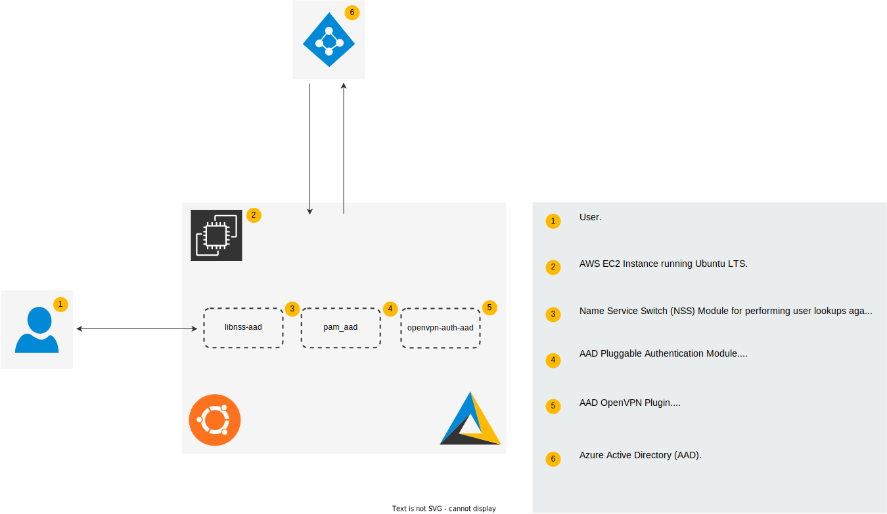

# Azure Active Directory for Linux

## Components

| Component                                                             | Description                            | Version |
| --------------------------------------------------------------------- | -------------------------------------- | ------- |
| [pam_aad](https://github.com/aad-for-linux/pam_aad)                   | Pluggable Authentication Modules (PAM) | v0.0.5  |
| [libnss-aad](https://github.com/aad-for-linux/libnss-aad)             | Name Service Switch (NSS) Module       | v0.0.3  |
| [openvpn-auth-aad](https://github.com/aad-for-linux/openvpn-auth-aad) | OpenVPN Authentication Plugin          | v0.0.2  |

## Distributions

| Distribution    | Version     | Status                                                                |
| --------------- | ----------- | --------------------------------------------------------------------- |
| Alpine Linux    | ---         | [Planned](https://github.com/aad-for-linux/aad-for-linux/issues/15)   |
| Debian          | 11.0        | [Supported](https://github.com/aad-for-linux/aad-for-linux/issues/23) |
| Rocky           | ---         | [Planned](https://github.com/aad-for-linux/aad-for-linux/issues/16)   |
| Ubuntu          | 20.04 LTS   | [Supported](https://github.com/aad-for-linux/aad-for-linux/issues/8)  |

## License

### Assets

[][cc-by-4.0]

The assets in this repository are licensed under a [Creative Commons Attribution 4.0 International License][cc-by-4.0].
The Azure Active Directory for Linux logo is a trademark of Infinite Omicron, LLC.
Inqueries on the permitted uses of the Infinite Omicron trademark can be sent [here](mailto:open.source@infinite-omicron.com).

[cc-by-4.0]: http://creativecommons.org/licenses/by/4.0

### Code

This repository contains software licensed under the GNU General Public License v3 or any later version.

For more information on the terms and conditions, see [COPYING](https://raw.githubusercontent.com/aad-for-linux/aad-for-linux/master/COPYING).

## See Also

- [AADLoginForLinux](https://docs.microsoft.com/en-us/azure/virtual-machines/linux/login-using-aad)

- [adsys](https://github.com/ubuntu/adsys)

